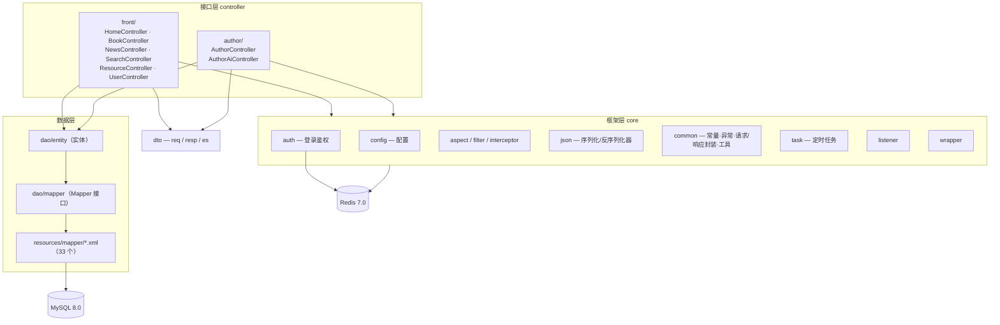

# novel（后端）

> **本项目是开源项目 [novel](https://github.com/201206030/novel) 的「后端」部分**，
> 原项目由 **201206030 / novel_dev_team** 开发并开源，遵循 **Apache License 2.0**。
> 本仓库为其后端工程的副本，用于学习与本地运行，**并非原创作品**；
> 代码与设计版权归原作者所有，详见 [归属与许可证](#归属与许可证)。

novel 是一套基于 **Spring Boot 3 + Vue 3** 的前后端分离**学习型**小说项目，
由小说门户系统、作家后台管理系统、平台后台管理系统等子系统构成，
包含小说推荐、作品检索、排行榜、阅读、评论、会员中心、作家专区、充值订阅、新闻发布等功能。

本仓库为**服务端**，前端见配套项目 `novel-front-web`。

---

## 技术栈

| 技术 | 版本 | 说明 |
|---|---|---|
| Java | **21** | `pom.xml` 中 `<java.version>` |
| Spring Boot | **3.3.0** | `spring-boot-starter-parent` |
| MyBatis-Plus | `${mybatis-plus.version}` | ORM 增强（`mybatis-plus-spring-boot3-starter`） |
| MyBatis-Plus Generator | — | 代码生成（配合 `velocity-engine-core` 2.3） |
| Redis | 7.0 | 分布式缓存（`spring-boot-starter-data-redis`） |
| Caffeine | — | 本地缓存（`spring-boot-starter-cache`） |
| JJWT | `${jjwt.version}` | JWT 登录支持（api / impl / jackson 三件套） |
| ShardingSphere-JDBC | 5.5.1 | 分库分表（`shardingsphere-jdbc.yml`） |
| Elasticsearch | 8.2.0（可选） | 搜索服务 |
| RabbitMQ | 3.10.2（可选） | 消息中间件 |
| XXL-JOB | 2.3.1（可选） | 分布式任务调度 |
| 构建 | Maven（含 `mvnw` / `mvnw.cmd` wrapper） | |

`pom.xml` 中项目 `version` 为 **3.5.1-SNAPSHOT**，`artifactId` 为 `novel`。

> Elasticsearch / RabbitMQ / XXL-JOB 默认关闭，通过 `application.yml` 中相应的 `enable` 属性开启。

---

## 架构分层

Java 包根路径为 `io.github.xxyopen.novel`（沿用上游作者的包名）。



---

## 目录结构

```
novel/
├── pom.xml                        # Maven 工程（Spring Boot 3.3.0 / Java 21）
├── mvnw / mvnw.cmd / .mvn/        # Maven Wrapper
├── src/main/java/io/github/xxyopen/novel/
│   ├── NovelApplication.java      # 启动类
│   ├── controller/
│   │   ├── front/                 # 读者端接口
│   │   └── author/                # 作家端接口
│   ├── core/                      # 框架层：auth / config / aspect / filter / interceptor
│   │   ├── json/                  # 自定义序列化与反序列化
│   │   ├── common/                # 常量、异常、请求/响应封装、工具
│   │   ├── task/  listener/  wrapper/
│   ├── dao/
│   │   ├── entity/                # 数据库实体
│   │   └── mapper/                # MyBatis-Plus Mapper
│   └── dto/
│       ├── req/  resp/            # 请求 / 响应对象
│       └── es/                    # Elasticsearch 相关 DTO
├── src/main/resources/
│   ├── application.yml            # 主配置
│   ├── shardingsphere-jdbc.yml    # 分库分表配置
│   ├── logback-spring.xml
│   └── mapper/                    # MyBatis XML（33 个）
└── doc/
    ├── sql/                       # novel.sql / shardingsphere-jdbc.sql / xxl-job.sql
    ├── es/                        # Elasticsearch 相关（book.http）
    └── style/                     # IntelliJ Google Java 代码风格
```

---

## 接口分层

| 分组 | Controller | 面向 |
|---|---|---|
| `controller/front` | `HomeController`、`BookController`、`NewsController`、`SearchController`、`ResourceController`、`UserController` | 读者端（小说门户） |
| `controller/author` | `AuthorController`、`AuthorAiController` | 作家端（作家专区） |

---

## 开发环境

| 组件 | 版本 | 必需 |
|---|---|---|
| JDK | 21 | ✅ |
| Maven | 3.8 | ✅ |
| MySQL | 8.0 | ✅ |
| Redis | 7.0 | ✅ |
| Elasticsearch | 8.2.0 | 可选 |
| RabbitMQ | 3.10.2 | 可选 |
| XXL-JOB | 2.3.1 | 可选 |
| Node | 16.14 | 仅前端需要 |

---

## 运行

```bash
# 1. 初始化数据库（按需）
mysql -u root -p < doc/sql/novel.sql

# 2. 配置连接信息
#    编辑 src/main/resources/application.yml 中的 MySQL / Redis 地址

# 3. 启动
./mvnw spring-boot:run
# 或打包后运行
./mvnw clean package -DskipTests
java -jar target/novel-*.jar
```

> 数据库脚本与分库分表脚本分别在 `doc/sql/novel.sql` 与 `doc/sql/shardingsphere-jdbc.sql`。

---

## 归属与许可证

### 上游项目

| 项 | 内容 |
|---|---|
| 项目 | **novel** —— 前后端分离学习型小说项目 |
| 作者 / 组织 | **201206030**（GitHub） / **novel_dev_team**（Gitee） |
| 后端仓库 | https://github.com/201206030/novel ｜ https://gitee.com/novel_dev_team/novel |
| 前端仓库 | https://github.com/201206030/novel-front-web ｜ https://gitee.com/novel_dev_team/novel-front-web |
| 线上应用版 | https://github.com/201206030/novel-plus |
| 微服务版 | https://github.com/201206030/novel-cloud |
| 配套教程 | https://docs.xxyopen.com/course/novel |
| **许可证** | **Apache License 2.0**（仓库内 `LICENSE` 文件） |

### 本仓库说明

- 本仓库是上述**上游后端项目**的副本，保留原始 `LICENSE`（Apache-2.0）与原作者署名
  （Java 包名 `io.github.xxyopen.novel` 即为上游作者标识），**未主张任何原创权利**。
- 依据 Apache-2.0，可自由使用、修改与再分发，但须保留版权声明与许可证文本，
  且不得使用原作者名义为衍生作品背书。
- 本项目为**学习用途**，上游作者亦将其定位为教学示例项目。
- `doc/sql/novel.sql.zip` 为数据库脚本压缩包，属上游项目原始资料。
